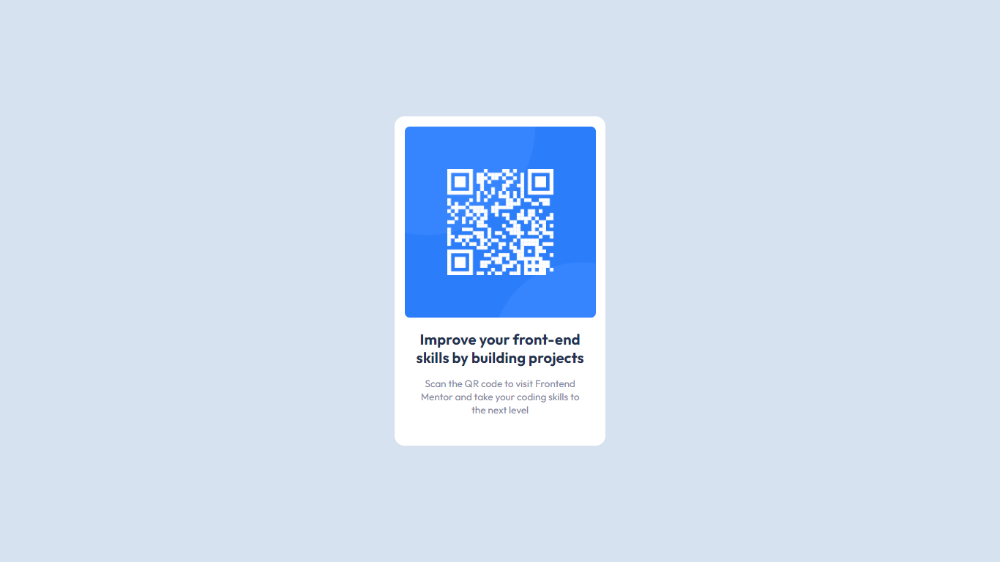

# Frontend Mentor - QR code component solution

This is a solution to the [QR code component challenge on Frontend Mentor](https://www.frontendmentor.io/challenges/qr-code-component-iux_sIO_H).

## Screenshot

## Live Preview:

[link](https://fe002m.netlify.app/)

## Author

- Frontend Mentor - [@swkarimi](https://www.frontendmentor.io/profile/swkarimi)
